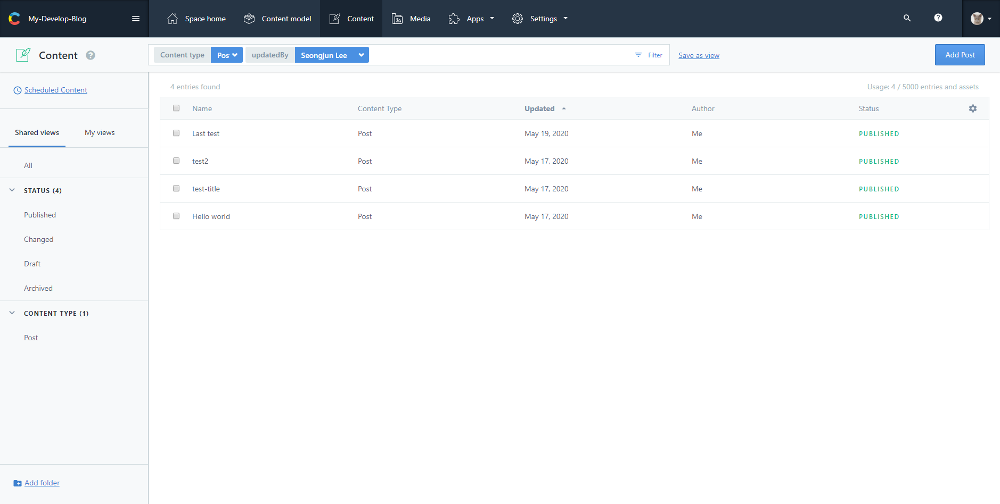
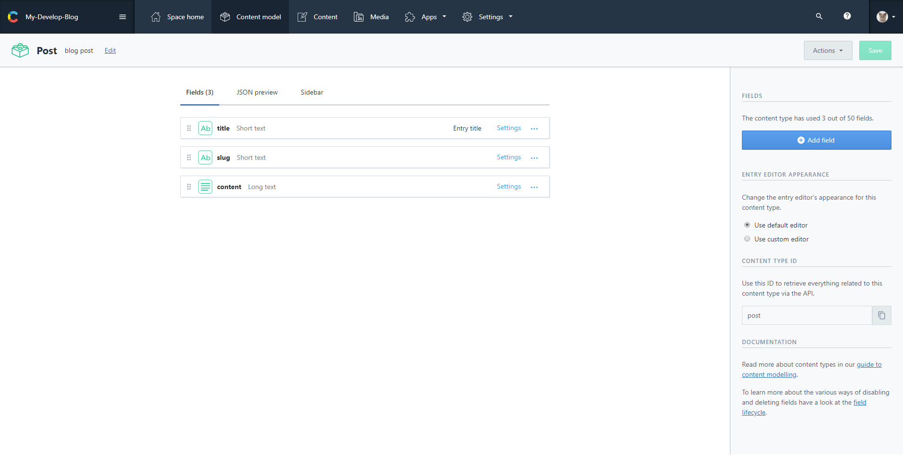
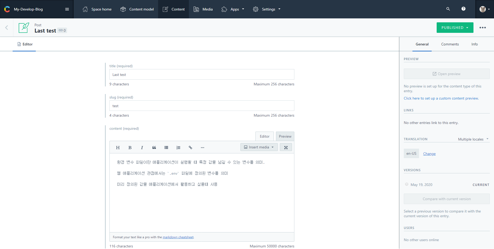
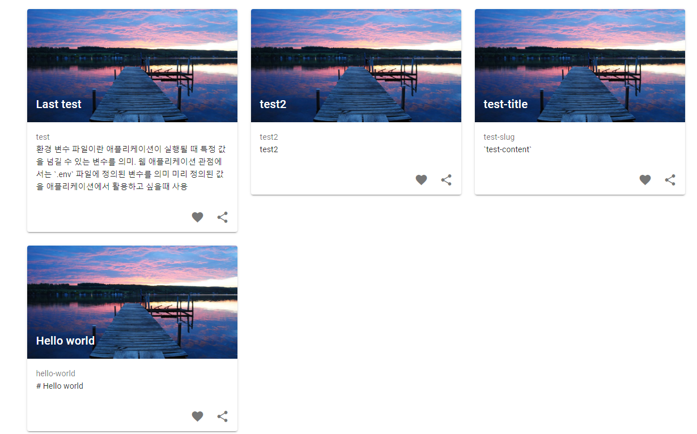
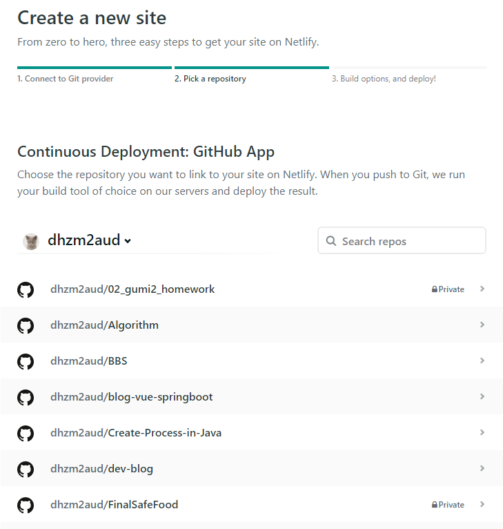
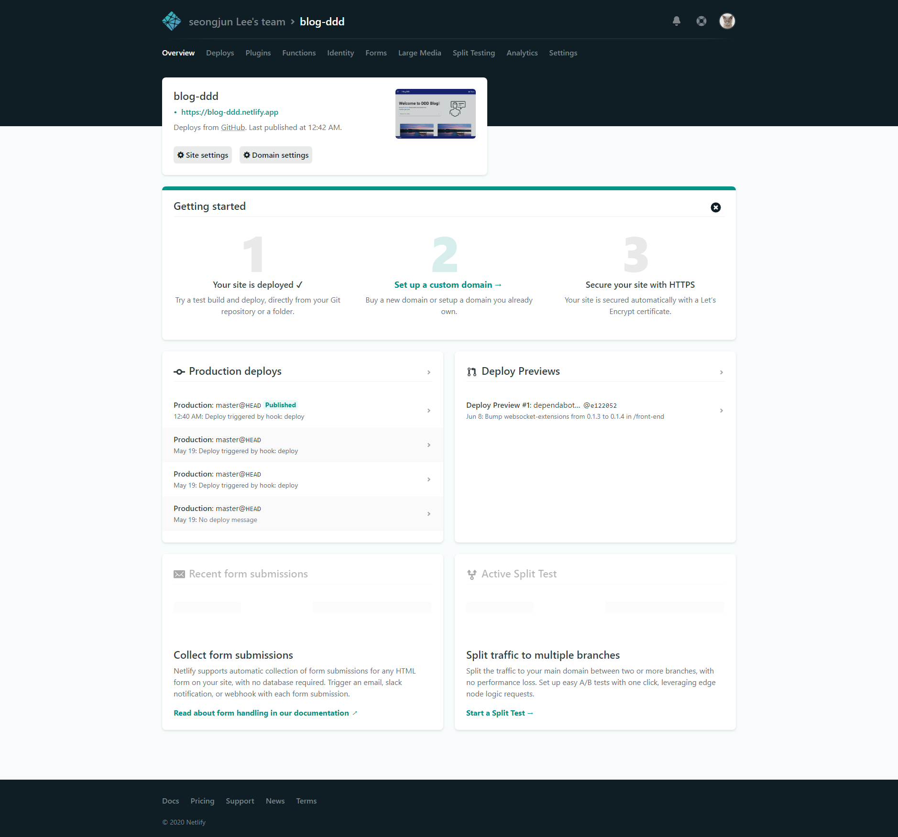

> 개발 블로그 만들기

경력은 쌓여가는데 슬프게도 개발 실력이 쌓이지 않는 불안감에서 시작하게되었고, 요즘 개발자들 사이에서 개인 블로그를 만든는 것이 유행이라는 말에 바로 만들어 보기로했다.😁

개발하면서 고민하거나 겪었던 이슈를 기록하고 나와 다른 개발자들에게 도움이 될 수 있는 공간을 만들고 싶었고, 마지막으로 나의 커리어를 어필하는 용도로 블로그가 매우 적합하다고 생각했다.

# 기술 스택 🔨

-   Back, Contentful of CMS
-   Front, Vue.js
-   Deploy, Nutify
-   Git

> 환경셋팅이 쉬운 기술을 이용하여 개발시간을 최대로 줄임 ( 저는 기술을 공부하고 사용한다고 5시간이나 걸림;;; )

## CMS란?

-   Contents Management System, 콘텐츠 관리 시스템

### 사용이유

-   `Back`이 필요없이 `프론트 & 디자인`으로만 웹 사이트를 만들어 낼 수 있음.
-   **오픈소스라서 무료**
-   기능 및 속도가 좋음
-   **편하게 컨텐츠를 관리 가능**

> 간단한 회사 홈페이지나 개인 홈페이지, 블로그 등은 CMS로 간단하게 만들 수 있음.

### Contentful api

-   CMS의 오픈소스 중 하나 5,000 엔티티까지 무료
-   워드프레스 사용자들은 익숙하게 사용 가능
-   여튼 직관적이여서 편해 보이며 사용 오픈소스가 많아보임



컨텐츠 관리하는 화면, Status를 통해 글을 publish 할지 안할지 결정 가능



글을 작성할때 필요한 템플릿을 커스텀하여 결정 가능



컨텐츠를 작서하는 화면으로 `Mark dowm`을 지원하여 언어만 알고있다면 편하게 글 쓰기 가능, 또 그림등도 업로드후 URI를 통해 표현가능

<br>

# 화면만들기 👨‍💻

Vue.js를 이용하여 프론트를 만들어보았다. UI 라이브러리는 [Vuetify](https://vuetifyjs.com/en/)를 이용하였다.

## 작업 순서

Contentful plugin을 설치한 후 import만 하면된다.

1. vue 프로젝트를 생성

    ```bash
    vue create "PROJECT_NAME"
    ```

2. plugin을 설치

    ```bash
    npm install contentfull
    ```

3. 설치한 플러그인을 import

    ```jsx
    // ./plugins/contentful.js

    const contentful = require('contentful');
    // use default environment config for convenience
    // these will be set via `env` property in nuxt.config.js
    const config = {
    	space: process.env.VUE_APP_CTF_SPACE_ID, // Space id
    	accessToken: process.env.VUE_APP_CTF_CDA_ACCESS_TOKEN, // Token
    };

    // export `createClient` to use it in page components
    module.exports = {
    	createClient() {
    		return contentful.createClient(config);
    	},
    };
    ```

    ```jsx
    // app.vue <script>

    import ...
    import contentful from "@/plugins/contentful.js";  // import contentful
    const client = contentful.createClient(); // return createClient()
    export default {
      name: "App",
      data() {
        return {};
      },
      components: {
        appbar,
        vfooter,
        vview,
      },
      methods: {
        setPosts(payload) {
          this.$store.commit("setPosts", payload); // vuex의 state.posts에 넣는 메소드
        },
      },
    // 프로젝트를 실행 할 때 모든 컨텐츠를 가지고와서 정적으로 사용할 예정
    // Vuex의 state.posts 변수에 담김
      mounted() {
        client
          .getEntries()
          .then((response) => {
            console.log(response.items);
            this.setPosts(response.items);
          })
          .catch(console.error);
      },
    };

    ```



<br>

# 배포하기

`Nutify` 를 이용해서 배포.

## Nutify란?

GitHub, GitLab 계정 연동 및 **쉬운 호스팅을 제공, 지속적 배포, One-Click HTTPS** 제공해줌.

### 사용이유

1. 서버사이드 렌더링 지원
2. https 무료 지원
3. 심플하고 깔끔한 인터페이스

일단 contentful에 글을 쓸때나 git에서 push를 했을때 hook을 통해 자동으로 Build 작업을 해주는 아주 멋진 녀석🤣. 무료로 DNS를 제공해줌.

### 진짜 쉬운 사용방법

1. 깃허브 연결

    

2. 호스팅 할려는 프로젝트 선택

    

3. 브런치 선택 후 빌드되는 경로 선택

    

4. published

    -   DNS를 자신이 원하는 것으로 바꿀수 있3
    -   현재 배포 상테를 체크할 수 있음
    -   github의 hook 연결과 contentful hook 연결을 통해 빌드 자동화 가능

    
